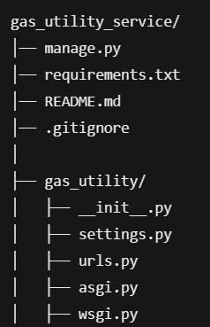
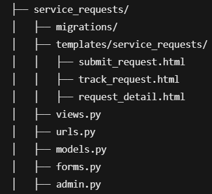
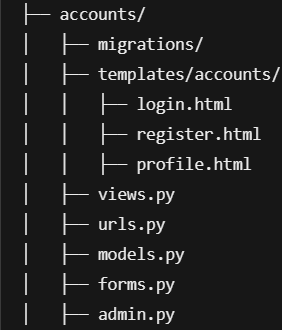
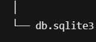

# Gas Utility Service - Django Application

A web application to provide consumer services for gas utilities, allowing customers to submit service requests, track their requests, view personal account details, and more. It also provides customer support representatives with tools to manage and resolve customer requests.

---

## Features 

### For Customers
-  Submit service requests online
-  Attach files (images/documents) to requests
-  Track the status of submitted requests
-  View personal account details

### For Customer Support Representatives
- View and manage customer requests
- Update request status (Pending, In Progress, Resolved)
- Provide customer support

---

## Project Structure 📂

